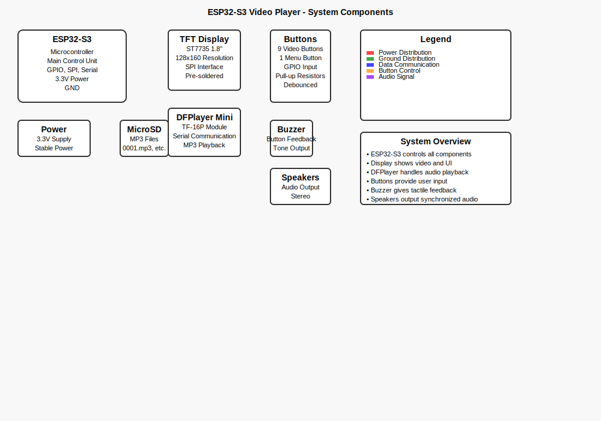

# 🎬 MJPEG Video Player - ESP32-S3 + TFT Display + Audio + Commlock

An interactive MJPEG video playback system for ESP32-S3 with a pre-soldered and working 1.8" TFT display, synchronized MP3 audio, and a special Commlock system inspired by "1999: A Space Odyssey". Ideal for creating interactive installations, informational displays, or presentation systems.

## 📋 System Overview


*Complete wiring diagram showing all components and connections*

## ✨ Features

- **MJPEG Video Playback** on 1.8" TFT display (128x160 pixels)
- **Synchronized MP3 Audio** via DFPlayer Mini module
- **Interactive Control** via physical buttons (up to 9 videos)
- **Commlock System** - Special display inspired by "1999: A Space Odyssey"
- **Configurable LED System** - LED activation for specific videos with customizable timing
- **Button Tone Feedback** when buttons are pressed
- **Simplified Display Management** through `DisplayManager` class
- **State System** (splash, home, menu, playback, commlock)
- **Integrated Error Handling** with recovery mechanisms
- **Button Debouncing** for reliable control
- **Professional Logging System** with multiple levels and categories

## 🧰 Required Hardware

### Main Components


- **ESP32-S3** (tested with ESP32-S3-DevKitC-1)
- **1.8" TFT ST7735 Display** (pre-soldered and working)
- **DFPlayer Mini MP3 Module** (TF-16P)
- **Pushbuttons** (up to 9 for video selection)
- **Buzzer** (for button tone feedback)
- **LED** (for video-specific feedback)
- **Power Supply** USB or regulated 3.3V
- **MicroSD Card** (for MP3 files)

### Pin Layout Reference


*ESP32-S3 pin layout for reference*

## 🔌 ESP32-S3 Pinout (Pre-soldered Display + Audio + LED)

### Simplified Wiring Diagram



*Simplified wiring diagram for quick reference*

### Detailed Connections

#### Display Connections
| Display Pin | ESP32 Pin | Function |
|-------------|-----------|----------|
| VCC         | 3.3V      | Power |
| GND         | GND       | Ground |
| CS          | GPIO 15   | Chip Select |
| RESET       | GPIO 4    | Reset |
| DC/RS       | GPIO 2    | Data/Command |
| MOSI (SDA)  | GPIO 13   | SPI Data |
| SCK         | GPIO 14   | SPI Clock |
| LED (BL)    | 3.3V      | Backlight |

#### DFPlayer Mini Connections
| DFPlayer Pin | ESP32 Pin | Function |
|--------------|-----------|----------|
| VCC          | 3.3V      | Power |
| GND          | GND       | Ground |
| RX           | GPIO 9    | Data In |
| TX           | GPIO 10   | Data Out |
| SPK_1        | Speaker + | Audio Output |
| SPK_2        | Speaker - | Audio Output |

#### Buzzer Connection
| Buzzer Pin | ESP32 Pin | Function |
|------------|-----------|----------|
| +          | GPIO 8    | Tone Output |
| -          | GND       | Ground |

#### LED Connection
| LED Pin | ESP32 Pin | Function |
|---------|-----------|----------|
| +       | GPIO 8    | LED Control |
| -       | GND       | Ground |

> **Note:** The display is pre-soldered and working. Pin configuration is in `PINS_ESP32-S3-LCD-ST7735_1_8.h`.

## 🎮 Button Control

The system supports up to 9 buttons for video selection:

| Button | GPIO Pin | Video File | Audio File | LED Behavior |
|--------|----------|------------|------------|--------------|
| 1      | 46       | `video_1.mjpeg` | `0001.mp3` | 5s duration, 500ms interval |
| 2      | 35       | `video_2.mjpeg` | `0002.mp3` | 3s duration, 300ms interval |
| 3      | 16       | `video_3.mjpeg` | `0003.mp3` | 4s duration, 400ms interval |
| 4      | 17       | `video_4.mjpeg` | `0004.mp3` | 6s duration, 600ms interval |
| 5      | 19       | `video_5.mjpeg` | `0005.mp3` | 2s duration, 200ms interval |
| 6      | 20       | `video_6.mjpeg` | `0006.mp3` | 7s duration, 700ms interval |
| 7      | 21       | `video_7.mjpeg` | `0007.mp3` | 3.5s duration, 350ms interval |
| 8      | 47       | `video_8.mjpeg` | `0008.mp3` | 4.5s duration, 450ms interval |
| 9      | 48       | `video_9.mjpeg` | `0009.mp3` | **Commlock System** |
| **Menu** | **5** | **Return to menu** | **No audio** | **No LED** |

> **Note:** Home video and menu have no audio. Button presses trigger a tone feedback. LED behavior is configurable in `LEDConfig.h`.

## 🚀 Commlock System - Level 1 Enhanced

### Special Feature: Authentic Commlock Display

**Button 9** activates a professional Commlock display inspired by "1999: A Space Odyssey":

- **Real-time Lunar Time Display** with seconds (HH:MM:SS)
- **Authentic Audio Feedback** with startup beep, ticks, and confirmations
- **Advanced Visual Effects** with CRT scan lines and glow effects
- **Lunar Day Progress** calculation and display
- **15-second duration** (configurable)
- **Professional Space Interface** with authentic colors

### Commlock Level 1 Features:
- ✅ **Authentic Audio System**
  - Startup beep (1200Hz, 200ms)
  - Tick sound every second (800Hz, 50ms)
  - Confirmation sounds for interactions (1500Hz, 150ms)
- ✅ **Realistic Lunar Time**
  - Real-time seconds display
  - Accurate lunar day progress calculation
  - Authentic time formatting
- ✅ **Advanced Visual Effects**
  - CRT scan line effects
  - Subtle glow effects around edges
  - Authentic Commlock color scheme
  - Professional visual styling
- ✅ **Enhanced Interface**
  - Larger time display with seconds
  - Lunar day progress percentage
  - Professional Commlock styling
  - Authentic 1999: A Space Odyssey theme

## 🔴 LED System

### Configurable LED Behavior

Each video can trigger a specific LED behavior:

- **Duration**: How long the LED blinks (milliseconds)
- **Interval**: Time between on/off states (milliseconds)
- **Enable/Disable**: Per-video LED activation
- **Automatic Activation**: LED starts when video begins

### Configuration

Edit `LEDConfig.h` to customize LED behavior:

```cpp
// Example configurations:
{0, 5000, 500, true},   // Video 1: 5s duration, 500ms interval
{1, 3000, 300, true},   // Video 2: 3s duration, 300ms interval
{2, 4000, 400, false},  // Video 3: LED disabled
```

### LED Examples:
- **Fast Alert**: `{0, 3000, 100, true}` - 3s, 100ms interval
- **Slow Ambient**: `{1, 10000, 1000, true}` - 10s, 1s interval
- **Continuous**: `{3, 15000, 200, true}` - 15s, 200ms interval
- **Disabled**: `{2, 5000, 500, false}` - LED off for video 3

## 🎵 Commlock Audio System

### Authentic Sound Design

The Commlock system features professional audio feedback:

#### Audio Frequencies:
- **Startup Beep**: 1200Hz, 200ms - Activates when Commlock starts
- **Tick Sound**: 800Hz, 50ms - Plays every second for authentic feel
- **Confirmation**: 1500Hz, 150ms - Plays when buttons are pressed

#### Audio Implementation:
```cpp
// Audio functions in Video.ino
void playCommlockBeep();     // Startup sound
void playCommlockTick();     // Second tick
void playCommlockConfirm();  // Button confirmation
```

## 🌙 Lunar Time System

### Realistic Lunar Calculations

The Commlock displays authentic lunar time:

#### Time Features:
- **Real-time Seconds**: Updates every second (HH:MM:SS)
- **Lunar Day Progress**: Shows percentage of lunar day completed
- **Accurate Calculations**: Based on actual lunar day duration

#### Technical Implementation:
```cpp
// Lunar time constants
#define LUNAR_DAY_HOURS 24
#define LUNAR_DAY_MINUTES (LUNAR_DAY_HOURS * 60)
#define LUNAR_DAY_SECONDS (LUNAR_DAY_MINUTES * 60)
#define LUNAR_DAY_MILLIS (LUNAR_DAY_SECONDS * 1000L)

// Time update functions
void updateLunarTimeRealistic();
void calculateLunarDayProgress();
```

## 🎨 Visual Effects System

### Advanced Commlock Interface

Professional visual effects for authentic experience:

#### Visual Features:
- **CRT Scan Lines**: Subtle blue scan lines every 100ms
- **Glow Effects**: Subtle blue glow around display edges
- **Authentic Colors**: Professional Commlock color scheme
- **Enhanced Typography**: Larger time display with seconds

#### Color Scheme:
- **Commlock Blue**: RGB(0, 150, 255) - Primary interface color
- **Commlock Green**: RGB(0, 255, 100) - Secondary elements
- **Commlock Orange**: RGB(255, 150, 0) - Progress indicators

#### Technical Implementation:
```cpp
// Visual effect functions
void drawCommlockAdvanced();
void drawCommlockCRTEffect();
void drawCommlockGlowEffect();
void updateCommlockVisualEffects();
```

## 📚 Required Libraries

Install these libraries via Arduino IDE:

1. **Arduino_GFX_Library** - Display graphics management
2. **LittleFS** - File system (included with ESP32)
3. **JPEGDEC** - JPEG decoding
4. **DFRobotDFPlayerMini** - MP3 audio playback
5. **SoftwareSerial** - Serial communication (included with ESP32)

## 📁 Project Structure

```
Video/
├── Video.ino                    # Main sketch
├── DisplayManager.h             # Display management class
├── PINS_ESP32-S3-LCD-ST7735_1_8.h  # Pin configuration
├── MjpegClass.h                # MJPEG decoding class
├── README.md                   # Documentation
├── examples/                   # Example sketches
│   ├── DisplayExample.ino      # Display usage example
│   ├── AudioExample.ino        # Audio usage example
│   └── README.md              # Examples documentation
├── data/                       # MJPEG video files
│   ├── home.mjpeg             # Home video (no audio)
│   ├── video_1.mjpeg          # Video 1
│   └── ...                     # Other videos
└── images/                     # Documentation images
    ├── board.jpg
    ├── pins.jpg
    ├── wiring_diagram.svg      # Complete wiring diagram
    └── wiring_diagram_simple.svg  # Simplified wiring diagram
```

## 🎞️ Video and Audio Preparation

### Video Conversion
Convert your videos to MJPEG format:

```bash
ffmpeg -i input.mp4 -t 5 -vcodec mjpeg -an -s 320x220 -aspect 1:1 -q:v 5 output.mjpeg
```

### Audio Preparation
1. Prepare MP3 files with the following naming convention:
   - `0001.mp3` for Video 1
   - `0002.mp3` for Video 2
   - `0003.mp3` for Video 3
   - ... and so on
2. Copy all MP3 files to the root of a microSD card
3. Insert the microSD card into the DFPlayer Mini module

### Parameter Explanation

- `-i input.mp4` - Input video file
- `-t 5` - 5 seconds duration
- `-vcodec mjpeg` - MJPEG codec
- `-an` - Remove audio
- `-s 320x220` - Output resolution
- `-aspect 1:1` - Force 1:1 aspect ratio
- `-q:v 5` - Quality (2=high, 31=low)

> **Tip:** Resize output to 128x160 to match display resolution.


## 🚀 Usage

### 1. File Preparation

1. Convert your videos to MJPEG format
2. Upload video files to the `data/` folder in the project
3. Prepare MP3 files with correct naming (0001.mp3, 0002.mp3, etc.)
4. Copy MP3 files to microSD card root directory
5. Insert microSD card into DFPlayer Mini module

### 2. Hardware Setup

1. Connect DFPlayer Mini to ESP32-S3:
   - RX (DFPlayer) → GPIO 9 (ESP32)
   - TX (DFPlayer) → GPIO 10 (ESP32)
   - VCC → 3.3V
   - GND → GND
2. Connect buzzer to GPIO 8 for button feedback
3. Connect speakers to DFPlayer Mini SPK_1 and SPK_2

### 3. Sketch Upload

1. Open `Video.ino` in Arduino IDE
2. Select ESP32-S3 board
3. Verify all libraries are installed
4. Compile and upload the sketch

### 4. System Operation

The system provides a complete multimedia experience:

- **🎬 Video Playback:** High-quality MJPEG videos on 1.8" TFT display
- **🎵 Audio Synchronization:** MP3 audio perfectly synchronized with video
- **🎮 Interactive Control:** 9 buttons for video selection + menu button
- **🔊 Audio Feedback:** Button tone feedback for user interaction
- **📱 State Management:** Smooth transitions between splash, home, menu, and video states

#### Operation Flow:
- **Startup:** Shows splash screen for 2 seconds
- **Home:** Automatically plays `home.mjpeg` (no audio)
- **Menu:** Press Menu button (GPIO 5) to access menu
- **Video Selection:** Press buttons 1-9 to play corresponding videos with audio
- **Button Feedback:** Each button press produces a tone
- **Exit:** Press Menu during playback to return to menu

## 🎯 System in Action

The complete system provides a professional multimedia experience with:

- **📺 Visual Display:** Crisp 128x160 TFT screen with vibrant colors
- **🎵 Audio Output:** High-quality stereo audio via DFPlayer Mini
- **🎮 User Interface:** Intuitive button control with tactile feedback
- **⚡ Performance:** Smooth 30 FPS video playback with synchronized audio
- **🔧 Reliability:** Robust error handling and state management

### Key Features Demonstrated:

1. **Synchronized Multimedia:** Video and audio start/stop together
2. **Interactive Feedback:** Button presses trigger immediate tone response
3. **Professional UI:** Clean menu system with centered text and colors
4. **Modular Design:** Easy to customize and extend functionality

## 🔧 DisplayManager Class

Display management has been simplified through the `DisplayManager` class, providing easy-to-use methods for display operations including text rendering, screen clearing, and JPEG frame drawing.

## 📚 Examples

The project includes example sketches in the `examples/` folder:

- **DisplayExample.ino** - Basic display operations and text rendering
- **AudioExample.ino** - DFPlayer Mini usage and audio control

See `examples/README.md` for detailed information about each example.

## 🎵 Audio Management

### DFPlayer Mini Functions

```cpp
// Initialize DFPlayer
void initializeDFPlayer() {
  mySerial.begin(9600, SERIAL_8N1, 9, 10);
  if (player.begin(mySerial)) {
    player.volume(25); // Volume 0-30
  }
}

// Play audio track
void startAudio(uint8_t trackNumber) {
  player.play(trackNumber); // Plays 0001.mp3, 0002.mp3, etc.
}

// Stop audio
void stopAudio() {
  player.stop();
}

// Button tone feedback
void playButtonTone() {
  tone(8, 800, 100); // 800Hz for 100ms
}
```

### Audio Features

- **Synchronized Playback:** Video and audio start together
- **Automatic Stop:** Audio stops when video ends
- **Volume Control:** Configurable volume (0-30)
- **Button Feedback:** Tone when buttons are pressed
- **Error Handling:** Graceful handling if DFPlayer is not connected

## 🎯 System States

1. **STATE_SPLASH** - Welcome screen
2. **STATE_HOME** - Home video playback (no audio)
3. **STATE_MENU** - Video selection menu
4. **STATE_PLAYING_VIDEO** - Video and audio playback
5. **STATE_ERROR** - Error handling

## 🛠️ Customization

### Modify Button Pins

```cpp
const uint8_t BUTTON_PINS[TOTAL_VIDEOS] = {
  46, 35, 16, 17, 19, 20, 21, 47, 48  // Modify here
};
```

### Add Videos with Audio

```cpp
const VideoInfo videoDatabase[TOTAL_VIDEOS] = {
  {"/video_1.mjpeg", "Video 1", 1},  // 0001.mp3
  {"/video_2.mjpeg", "Video 2", 2},  // 0002.mp3
  // Add here
};
```

### Audio Configuration

```cpp
#define BUTTON_TONE_FREQ 800        // Button tone frequency
#define BUTTON_TONE_DURATION 100    // Button tone duration (ms)
player.volume(25);                  // Audio volume (0-30)
```

### Modify Configuration

- **FPS:** `#define TARGET_FPS 30`
- **Buffer:** `#define MJPEG_BUFFER_SIZE (40 * 1024)`
- **Debounce:** `#define DEBOUNCE_DELAY 50`
- **Audio Volume:** `player.volume(25)`

## 🐛 Troubleshooting

### Display Not Working
- Check 3.3V power supply
- Verify SPI connections
- Check pin configuration in `PINS_ESP32-S3-LCD-ST7735_1_8.h`

### Audio Not Working
- Verify DFPlayer Mini connections (RX/TX swapped)
- Check microSD card format (FAT32)
- Ensure MP3 files are named correctly (0001.mp3, 0002.mp3, etc.)
- Check speaker connections
- Verify power supply (DFPlayer needs stable 3.3V)

### Video Not Loading
- Verify MJPEG format
- Check file size (max 1MB recommended)
- Verify memory space

### Buttons Not Responding
- Check connections (pull-up)
- Verify debounce delay
- Check GPIO pins
- Verify buzzer connection for tone feedback

## 📊 Technical Specifications

- **Display:** 1.8" TFT ST7735 (128x160)
- **Microcontroller:** ESP32-S3
- **Memory:** 8MB PSRAM
- **Video Format:** MJPEG
- **Audio Format:** MP3
- **Audio Module:** DFPlayer Mini TF-16P
- **FPS:** 30 (configurable)
- **Buttons:** 9 + Menu
- **Audio Output:** Stereo via DFPlayer Mini
- **Button Feedback:** Tone via buzzer

## 🏆 Project Showcase

This project demonstrates advanced ESP32-S3 capabilities:

- **🎬 Multimedia Integration:** Seamless video and audio synchronization
- **🎮 Interactive Design:** Professional user interface with tactile feedback
- **🔧 Modular Architecture:** Clean, maintainable code with DisplayManager class
- **📚 Comprehensive Documentation:** Complete wiring diagrams and setup guides
- **⚡ Performance Optimized:** Efficient memory usage and smooth playback

### Perfect For:
- **Interactive Installations:** Museums, exhibitions, public spaces
- **Educational Projects:** Learning ESP32, multimedia, and embedded systems
- **Prototyping:** Rapid development of multimedia interfaces
- **Custom Applications:** Easy to modify for specific use cases

## 🤝 Contributions

Feel free to fork, customize, and improve this project!

---

**Happy coding! 🚀**
